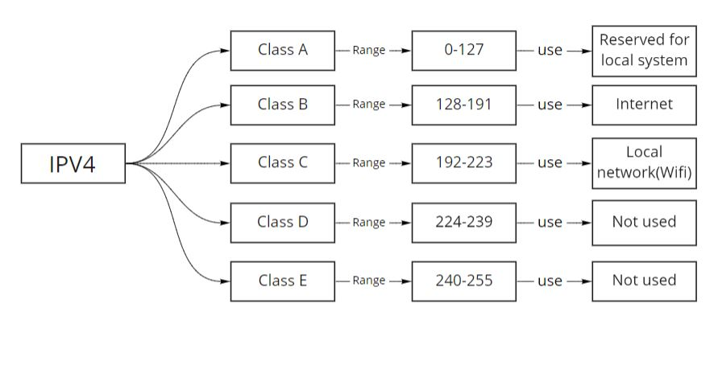
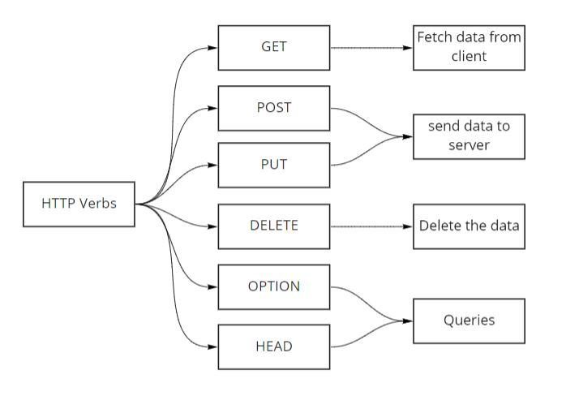
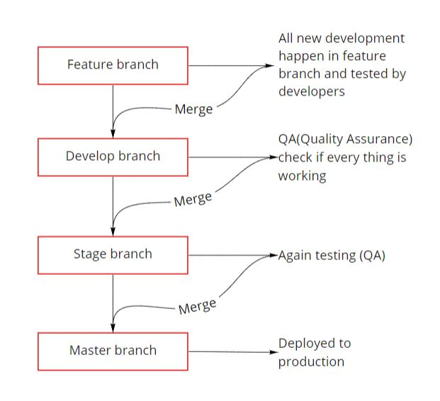

# **Basic Building Block of Web development Aplication**

## **IP Address**
It was created by IANA (Internet Assigned Number authority)
* IP v4 -  It is 32 bit IP address
* IP v6 - It is 128 bit IP address, never adapted because it was difficult to remember

### Class range of IP v4

 

## **Port**
IP + Port gives entry to the system
### Range
* 0-1023 - (reserve port used by system)
* 1024-4915 - (Application port/you can run application on this port)
    * 3000-9000 - (Most used port)
* 49151-65535 - (Open port)
    * Should not use this port to run application
### Web port
* 80 - Not secured(HTTP)
* 443 - Secured(HTTPS)

 

## **HTTP Verbs**

 

## **HTTP Headers**
* It is use for data exchange between browser and server
* Using a headers application is sending data to the server and based on that server may or may not decide to do something.
* Mostly use in
    * Passing data
    * Authentication
    * Passing keys

 

### **HTTP Status code**
### 1XX series (informative)
| Code | Status                             |
|------|------------------------------------|
| 100  | Continue                           |
| 101  | Switching portocol                 |
| 102  | Processing(processing the request) |

### 2xx series(Success)
| Code | Status                        |
|------|-------------------------------|
| 200  | OK(request succeeded)         |
| 201  | Created(new resource created) |
| 202  | Accepted                      |
| 203  | Non-authoritative information |
| 204  | No content                    |

### 3XX series(Related to Migration)
| Code | Status            |
|------|-------------------|
| 300  | Created           |
| 301  | Moved permanently |

### 4XX series(User generated / Client Error)
| Code | Status           |
|------|------------------|
| 400  | Bad Request      |
| 401  | Unauthorized     |
| 402  | Payment Required |
| 403  | Forbidden        |
| 404  | Not found        |

### 5XX series (Server Error)
| Code | Status                |
|------|-----------------------|
| 500  | Internal server error |
| 501  | Not implemented       |
| 502  | Bad Gateway           |
| 503  | Service unavailable   |

 

## **Software License**
* Apache 2.0
* MIT
* BSD
* GPL
* Mozilla

*Note: Nodejs made on MIT license*

 

## **Database**
It is use to store data

In 2 ways data can be stored 
1. **Relational database:-**
	It is in the form of table and every table is related to each other
    * MYSQL
    * PostgreSQL
    * MariaDB

2. **Non relational database:-** 
	It stored in key value pair
    * MongodB
    * Redis
    * Cassandra
    * NeoJS 

 

## **Cloud Providers**
* AWS
* Google Cloud
* Azure
* BlurMix
* Digital Ocean
* Vultr
* Linode
* Heroku

 

## **Code Repository**
* Github
* Gitlab
* Bit bucket

 

## **Project management tool**
* Jira
* Google sheet
* Trello
* Asana

 

## **Git Dev Workflow**

 

## **Infrastructure**
* Dev (Development)
* UAT(User acceptance test)/Staging (QA test entire application before deployment)
* Production System

 
