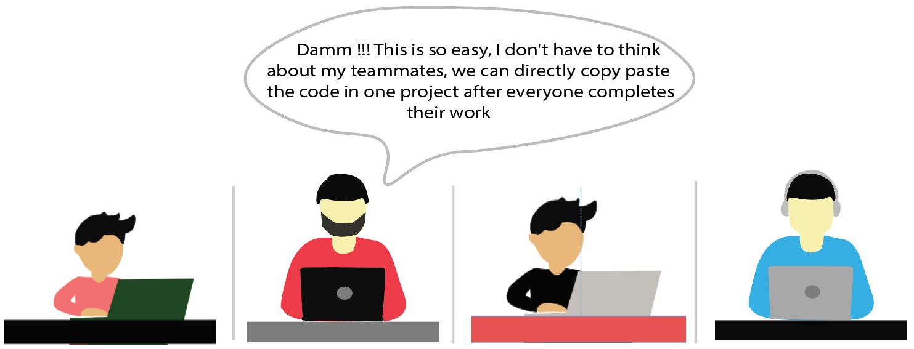

# **What is git?**
Git is an open source software which is used by developers to contribute to projects simultaneously. It allows collaboration easier, allows changes by multiple people and it can be merged into one source file/Repository.

It tracks all the changes done in the source file, and you can also undo or jump to specific changes. We can also see which person has contributed which part of the code.

 

# **Git commands**

 ## 1. Basic commands used in local repository

|**Command**                        |**Description**                                        |
|:----------------------------------|:------------------------------------------------------|
|git show <commit_id>               |Show the changes in all the fil(use after commit)      |
|git add .                          |Add all the file to staging are                        |
|git add <file_name>                |Add specific file to staging area                      |
|git commit -m “[commit message]”   |Commit changes from staging area to local repository   |
|git diff                           |Show changes in all the files(use before commit)       |
|git diff <file_name>               |Show changes in specific file(use before commit)       |
|git status                         |Check status                                           |
|git log                            |View history of all commits                            |

 ## 2. Command use in sharing and updating in Remote repository

| **Command**                            | **Description**                                                               |
|----------------------------------------|-------------------------------------------------------------------------------|
| git push origin <branch_name>          | Push changes of specific branch to remote repository                          |
| git push -u origin <branch_name>       | Push changes of specific branch to remote repository(and remember the branch) |
| git push                               | Push changes to remote repository(remembered branch)                          |
| git pull origin <branch_name>          | Pull changes from remote repository                                           |
| git push origin --delete <branch_name> | Delete a remote branch                                                        |

  
 ## 3. Command use in sharing and updating in Remote repository

| **Command**                               | **Description**                       |
|-------------------------------------------|---------------------------------------|
| git branch                                | List all the branch                   |
| git branch <branch_name>                  | Create a new branch                   |
| git branch <branch_name> -D               | Delete branch                         |
| git branch -m <old_branch> <new_branch>   | Rename a local branch                 |
| git checkout --<file_name>                | Revert the changes in specific file   |
| git checkout <branch_name>                | Switch to different branch            |
| git merge <branch_to_be_merge>            | Merge a branch into the active branch |
| git merge <source_branch> <target_branch> | Merge a branch into a target branch   |
| git reset HEAD <file_name>                | Remove file from staging area         |
| git stash                                 | Put current file into stash           |
| git stash pop                             | Pop the file from stash               |

 

# **Story of why we need to use git**
## There are 4 developers named as Ramesh, Suresh, Rakesh, and Rham. They decided to meet and discuss a new application.

 
## They list down all the features that need to be developed and divide equally amongst them and start working individually on assigned features.
 

 

## After 2 week they finish all their work and decide to meet and copy paste their work in a single project.
 

 

## 2 days later.......
 

 

## While they are arguing a pro developer Raj passes by.....
 

 

## Raj started explaining all the commands about git

**Moral of the story:-** Before starting working on any project we have to learn about git and its command so that your team members can work simultaneously on the same project. 

