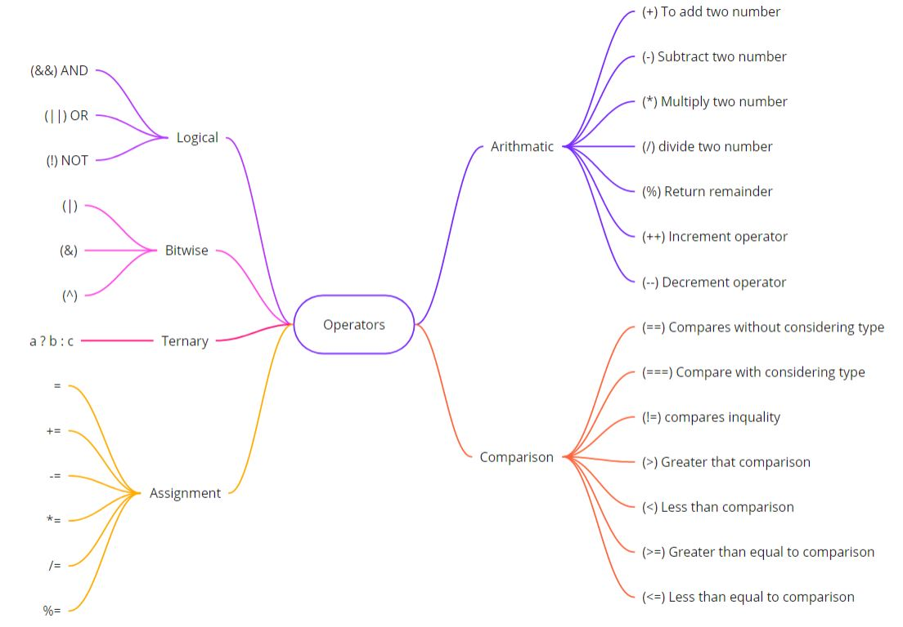
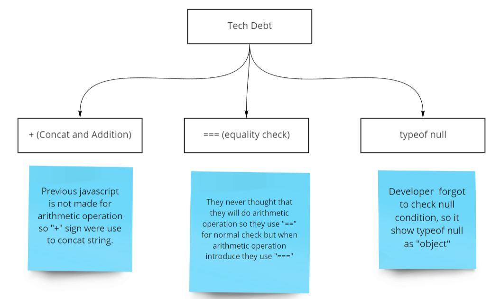

# **Javascript history and some basic concepts**

## **History**


<br/>

## **Control structure in javascript**


<br/>

## **Operator in javascript**



### **Ternary operator**
```javascript
// condition ? (if true) : (if false);
var marks1 = 30;
(marks1 > 35)? console.log("1 => Pass") : console.log("1 => Fail") 

var marks2 = 50;
(marks2 > 35)? console.log("2 => Pass") : console.log("2 => Fail") 
```
Output 
```
1 => Fail
2 => Pass
```

### **Logical operator**

**AND(&&) operation**               
|       |       |       |
|-------|-------|-------|
| True  | True  | True  |
| True  | False | False |
| False | True  | False |
| False | False | False |

**OR(||) operation**
|       |       |       |
|-------|-------|-------|
| True  | True  | True  |
| True  | False | True  |
| False | True  | True  |
| False | False | False |

**NOT(!) operation**

!true = false

!false = true
<br/>

## **Tech debt**


