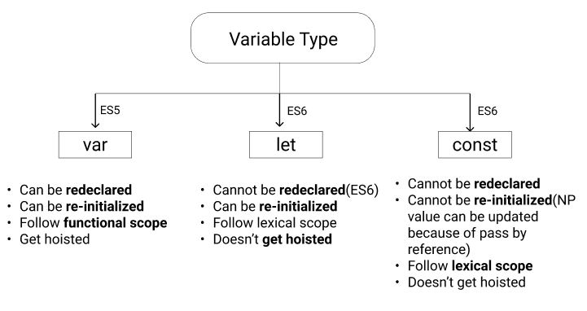

# **Variables**

Javascript has dynamic type of variable it means
* Type of variable is declared after assigning value
* It type decide during runtime

<br/>

## **Variable data type**


### **Call/Copy by value (Primitive type)**


**Real life example:-**
Let’s say Ram and Sita are two best friends, Sita goes to tuition and Ram does not go to tuition. Sita needs to fulfil her duties of being best friend by giving Ram all the notes so she photocopy the notes and give it to Ram to study. By doing this Ram and Sita have their own Notes(Value).

### **Call/Copy by reference (Non primitive type)**


**Real life example:-**
Let’s say Ramesh and Suresh are twin brothers and they share the same textbook. If Ramesh do some marking in the textbook that can seen by Suresh or vice versa
In this example Ramesh and Suresh are variable and textbook is value.

<br/>

## **Variable Type**


> *Note:- when we declare a const variable it has to be declared and assigned at the same time*

<br/>

## **What do you mean by Hoisting ?**


* Hoisted happen only with ES5 variable i.e var
* Whenever we declare a variable(var), the javascript engine makes the variable(var) float at the top of the program.

> *Note: Only declaration gets hoisted, not assignment of value.*

<br/>

## **Functional Scope(ES5)**


**Example of Local functional scope:-**
If we declare and initialize the variable inside the function then scope of this variable is valid only inside the function.

```javascript
var b = 1;
console.log("Before function call",b);
function f1(){
    var b = 2;//This will act as a local function scope which will not override actual b value
    console.log("inside function",b);
};

f1()
console.log("after function call",b);
```
Output
```console
Before function call 1
inside function 2
after function call 1
```

**Example of Global functional scope:-**
If we declared the variable outside the function and initialize or re-initialized inside the function then the scope of that variable is global (i.e it will be valid outside the function)

```javascript
var b = 1;
console.log("Before function call",b);
function f1(){
    b = 2;//This will act as a global function scope which will override actual b value
    console.log("inside function",b);
};

f1()
console.log("after function call",b);
```
Output
```console
Before function call 1
inside function 2
after function call 2
```

> *Note: Local scope variable get hoisted inside the function*

<br/>

## **Lexical scope**


**Example of Local lexical scope:-**
If we declare and initialize the variable inside the curly bracket then scope of this variable is valid only inside the function.

```javascript
let a = 4;

console.log("Before curly brackets ",a);
if(a){  //"a" is a truthy value  
    let a=9; //This will have local lexical scope which will not override actual "a" value 
    console.log("Inside curly brackets ",a);
};

console.log("After curly brackets",a);
```
Output
```console
Before curly brackets 4
Inside curly brackets 9
After curly brackets 4
```

**Example of global lexical scope:-**
If we declared the variable outside the curly brackets and initialize or re-initialized inside the curly brackets then the scope of that variable is global (i.e it value will be valid outside the curly brackets)

```javascript
let a = 4;

console.log("Before curly brackets ",a);
if(a){  //"a" is a truthy value
    a=9; //This will have global lexical scope which will override actual "a" value 
    console.log("Inside curly brackets ",a);
};

console.log("After curly brackets",a);
```
Output
```console
Before curly brackets 4
Inside curly brackets 9
After curly brackets 9
```

> ### **Most Important concept**
**If we pass a parameter inside function then that parameter will have local scope, Why??**
* Because the javascript engine will automatically declare this variable inside the function and we know if the variable is declared inside the function it will have local scope.

<br/>

## **Falsy and Truthy value**


<br/>

## **Special Arithmetic operation**

 **1. On primitive type**
* When we are using “+” and one of the value is string then it concat

```bash
>"1" + 2
< "12"
```
* If we are using other arithmetic operation and one of the value is string then js engine will convert into number and do arithmetic operation
```bash
> "10" * 2
< 20

> "200"/2
< 100
```
* If we are doing mathematical operation with boolean then true = 1 and false = 0
```bash
> true + 1
< 2

> false + 5 
< 5
```
* null + (any number) = (that number) because null is always taken as 0
```bash
> null + 10
< 10

> null + true
< 1
```
* Any mathematical operation with undefined will be NaN
```bash
> undefined + 8
< NaN

> undefined * 10
< NaN
```

**2. On Non primitive type**
* If we try to add any NP type javascript engine convert it into string and concat
```bash
> [] + [] 
< ""

> [1] + [2]
< "12"

> [1] + [2,3,4] 
< "12,3,4"

>{} + 1
< "1"

>{} + {}
< "[object Object][object Object]"
```

## **Special Logical operation**
**1. AND(&&)**
* If the value is true then it will evaluate the next operation.
* If the value is false then it will be false and it will stop evaluating.
```bash
> true && 6
< 6

> true && 10 && 19
< 19

> false && 2
< false

> true && false && 3
< false
```

**2. OR(||)**
* If the first value is false then it will print value next to it.
* If first value is true then output will be true

```bash
> false || 5
< 5

> false || 10 || 2
< 10

> false || true || 1
< true

> true || false
< true

> 0 || "class" || 3
< "class"

```
