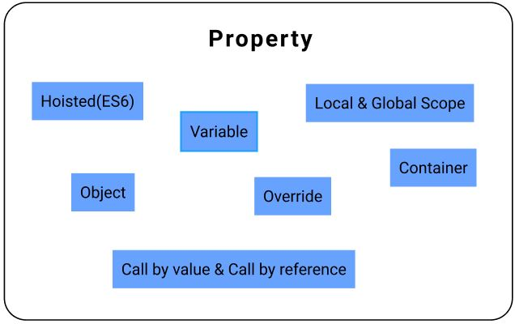
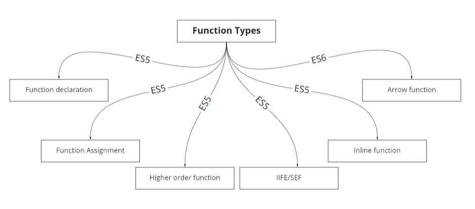

# **Function**

## **Properties**


<br/>

### **Object:- Function can act as an object** 
```javascript
function f1(){  //function f1 is declared
    console.log("This is a demo function");
};

f1();   //function f1 called

f1.say = "I am a demo object";  //Note: When we use .(dot) it act as an object and store key = say and value = "I am a demo object"
console.log(f1);    //It will consist of object and function
console.log(f1.say);
```
Output
```
This is a demo function
[Function: f1] { say:"I am a demo object" }
I am a demo object
```

### **Variable:- Function can be assign to any variable**
```javascript
var f1 = function(){
    console.log("Example of function assignment and using function as variable");
}
f1();
```
Output
```
Example of function assignment and using function as variable
```

### **Hoisting:- Function declaration get hoisted**
```javascript
f1(); //function call

function f1(){  //function declared. This function will get hoisted on top of the program
    console.log("Example of hoisted function")
}
```
Output
```
Example of hoisted function
```

### **Override:- Function can be overridden**
```javascript
function f1(){
    console.log("First function")
}

function f1(){
    console.log("Overridden/Second function")
}

f1()
```
Output
```
Overridden/Second function
```
### **Local and Global scope:- Function can have local and global scope**
```javascript
function f1(){ 
    console.log("Heyyy!! I am outside main function");
};

function f2(){ //global function and can also be called inside the function
    console.log("Heyy!! I am f2 function and outside the main function");
};

function main_function(){ 
    console.log("Main function called");
    
    function f1(){ //This function will have local scope(valid inside main_function)
        console.log("Heyy!! I am inside main function");
    } 
    f1();
    f2();

};

main_function();
f1();
```
Output
```
Main function called
Heyy!! I am inside main function
Heyy!! I am f2 function and outside the main function
Heyyy!! I am outside main function
```
### **Pass by value & Pass by reference**
* If we pass primitive value as a parameter then it is Pass by value
* If we pass Non primitive value as a parameter then it is Pass by reference(because reference of that object is pass as a parameter)

<br/>

## **First class Citizen**
Function always act as a First class citizen i.e
* Can return function
* Pass as a parameter
* Can act as a class, object
* assign to a variable

<br/>

## **Type of function**


### **Function declaration**
```javascript
function declaration_type(){
    console.log("This is the example of function declaration");
};

declaration_type();
```
Output
```
This is the example of function declaration
```
> *Note: This function get hoisted.* 


### **Function assignment**
```javascript
var assign_type = function(){
    console.log("This is the example of function Assignment");
};

assign_type();
```
Output
```
This is the example of function Assignment
```
> *Note: In this var assign_type get hoisted, not a function.*


### **Higher order function**
It's job is to align the code(avoid messy code)
* Can return function
* Can take parameter as function
* Can take parameter as a function and return function


```javascript
var f1 = function(){
    console.log("This function is use to give as a parameter");
};

function main_function(param){
    param();//called pass function

    var f2 = function(){
        console.log("This function is use to return as a function");
    }; 
    return f2;//returning inside function
}

var a = main_function(f1);//calling main_function and passing function as a parameter
                          //it will return f2 function and a will have reference of f2 function
a();//calling return(f2) function
```
Output
```
This function is use to give as a parameter
This function is use to return as a function
```

### **IIFE(SEF)**
* IIFE ( Immediately invoked function expression )
* SEF ( Self executing function )
* Function can run only ones

```javascript
(function(){
    console.log("IIFE Example.............");
})();

(function(param){
    console.log("IIFE Example.............with ",param);
})("value");
```
Output
```
IIFE Example.............
IIFE Example.............with value
```
> *Note:- It can be used to achieve closure.*

### **Inline function**
* Function is pass as a parameter inside function directly without using any variable.
* It is used when we want to pass a function that we don't want to call separately and only serves the purpose of passing to a function .
* It can be used to achieve closure.

```javascript
(function(param){
    console.log("This is inside function");
    param();
})(function(){
    console.log("This is the Inline function which only serves the purpose of passing to a function");
});
```
Output
```
This is inside function
This is the Inline function which only serves the purpose of passing to a function
```

### **Arrow declaration**
```javascript
var arrow = ()=>{ //declaration of arrow function
    console.log("This is a arrow function");
}

arrow();//call arrow function
```
Output
```
This is a arrow function
```
> *Note: Only “var arrow” get hoisted not the function*

<br/>

## **Things you need to remember when you are using function**
* Every function need to be pure function
* What is pure function?
	* Function which does not change global variable value (Scope is within function).
* When we are dealing with a **primitive type** variable, pass this variable as a parameter so that it does not override/change the global variable.

```javascript
var a = 10;
var b = 20;
function f1(a, b){
    b = a + b;//b is updated but its scope is within the function
    console.log("Updated b value=>",b);
    return b;
};

console.log("return value of function=>",f1(a,b));
console.log("original b value(remain same)=>",b);
```
Output
```
Updated b value=> 30
return value of function=> 30       
original b value(remain same)=> 20 
```

* When we are dealing with **Non primitive type** variable, create local variable object inside function and manually pass primitive value inside local variable object

```javascript
const obj_outside = {
    fname:"siddhesh",
    lname:"shinde",
    exp:0
}
function f1(obj){
    const obj_inside = {    //this variable will have local scope and not update global object
        fname:obj.fname,
        lname:obj.lname,
        exp:obj.exp
    }
    obj_inside.fname="ramesh"
    obj_inside.lname="something"
    obj_inside.exp=2
    console.log("Inside object==>>>>",obj_inside);
};

f1(obj_outside);
console.log("Outside object==>>>>",obj_outside);
```
Output
```
Inside object==>>>> { fname: 'ramesh', lname: 'something', exp: 2 }
Outside object==>>>> { fname: 'siddhesh', lname: 'shinde', exp: 0 }
```

> *Note:- we can also use spread operator(ES6)*

**We should handle errors gracefully**
```javascript
function main(params){ //it take function as a parameter
    console.log("inside main function")
    params && (typeof params === "function") && params() //If passed parameter is not a function then system will not crash 
}

main(function(){
    console.log("passed function")
})
console.log("---------------------")
main(1)
```
Output
```
inside main function
passed function
---------------------
inside main function
```


