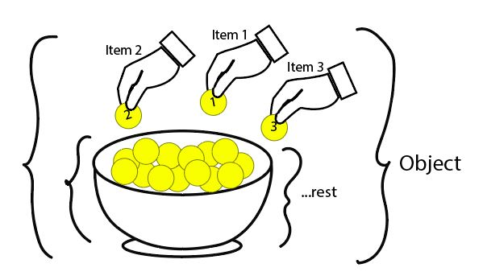

# **Javascript constructor and prototype**
Function in js can be converted into prototype(also known as class in other languages).


Javascript prototype mimic object oriented programming.

Every object derives from the prototype object and that prototype object derives from the prototype object and so on………. We cannot define end of the object.


## **Function act as prototype object**

```javascript
function Car(name, number){
    this.name = name
    this.number = number
}

var c1 = new Car("Maruti",1232);
var c2 = new Car("Toyota",4213);
console.log("Prototype 1 ===>",c1);
console.log("Prototype 2 ===>",c2);
```
Output
```
Prototype 1 ===> Car { name: 'Maruti', number: 1232 }
Prototype 2 ===> Car { name: 'Toyota', number: 4213 }
```

## **Method in prototype**
getName and getNumber is a method of Car prototype. We can use this method to get the value of name and number from Car prototype. 

```javascript
function Car(name, number){
    this.name = name
    this.number = number
}
Car.prototype.getName = function(){
    return this.name;
}

Car.prototype.getNumber = function(){
    return this.number;
}

var c1 = new Car("Maruti",1232);
var c2 = new Car("Toyota",4213);
console.log("Prototype 1 ===>",c1);
console.log("Prototype 1 ===>"+c1.getName()+" "+c1.getNumber());
console.log("Prototype 2 ===>",c2);
console.log("Prototype 2 ===>"+c2.getName()+" "+c2.getNumber());
```
Output
```
Prototype 1 ===> Car { name: 'Maruti', number: 1232 }
Prototype 1 ===>Maruti 1232
Prototype 2 ===> Car { name: 'Toyota', number: 4213 }
Prototype 2 ===>Toyota 4213
```

## **Inheritance**
Simpler way to explain Inheritance is parent and child relationship. Child prototype will inheritance all the method and variable from parent prototype.  

```javascript
function Machine(engine_number){    //parent prototype
    this.engine_number = engine_number;
};

function Car(model_number){ //child prototype
    this.model_number = model_number; 
};

Car.prototype.__proto__ = new Machine("ADS156382");//Car is inheritance from Machine
var car = new Car("SDFW143643");

console.log("Car model number=>",car.model_number);
console.log("Car engine number=>",car.engine_number);
```
Output
```
Car model number=> SDFW143643
Car engine number=> ADS156382
```

## **Constructor**

* If we use .(dot) after any variable it will convert into object and we can be able to use its builtin method


### **Array constructor**

| Method              | Description                                               |
|---------------------|-----------------------------------------------------------|
| arr1.length()       | Calculate length of array (length will be last_index + 1)                       |
| arr1.push(value)    | Add value at end of array                                 |
| arr1.pop()          | Remove last value                                         |
| arr1.unshift(value) | Add value at beginning of array                           |
| arr1.shift()        | Remove first value                                        |
| arr1.concat(arr2)   | to concat 2 array                                         |
| arr1.forEach()      | Better version of for loop                                |
| arr1.map()          | Use to transform array item                               |
| arr1.filter()       | We can remove/filter the array by giving condition        |
| arr1.indexOf(item)  | Return index value                                        |
| arr1.include(item)  | To check if value is present or not, return boolean value |
| arr1.join()         | Join each item and return string                          |
| arr1.sort()         | To sort                                                   |
| arr1.reverse()      | To reverse                                                |
| Array.isArray(arr1) | To identify array data type, return type is boolean       |
| array.slice(start_index, end_index) | Use to slice the array                    |


**arr1.forEach() Built-in method**
```javascript
arr1=["Ramesh", "Suresh","Sham","Ram","Raj"]

arr1.forEach(function(item, index){ //inline function is used 
    console.log("value=>"+item + " index=>"+index);
});
```
Output
```
value=>Ramesh index=>0
value=>Suresh index=>1
value=>Sham index=>2  
value=>Ram index=>3
value=>Raj index=>4
```

**arr1.map() Built-in function**
```javascript
arr1=["Ramesh", "Suresh","Sham","Ram","Raj"]

let mod_arr = arr1.map(function(item){
    return "Heyyy!! "+item; 
});
console.log(mod_arr);
```
Output
```
[
  'Heyyy!! Ramesh',
  'Heyyy!! Suresh',
  'Heyyy!! Sham',  
  'Heyyy!! Ram',   
  'Heyyy!! Raj'    
]
```

**arr1.filter() Builtin function**
```javascript
arr1=["Ramesh","", "Suresh","Sham",undefined,"Ram",null,"Raj"]

//Task is to filter print only name
var filter_arr = arr1.filter(function(item){
    return !!item;
});
console.log(filter_arr);
```
Output
```
[ 'Ramesh', 'Suresh', 'Sham', 'Ram', 'Raj' ]
```
<br/>

### **Object constructor**
| Method                  | Description                           |
|-------------------------|---------------------------------------|
| Object.create           | To create Object                      |
| Object.keys(obj1)       | Return array of keys                  |
| Object.value(obj1)      | Return array of value                 |
| Object.freeze(obj1)     | Cannot be modified                    |
| Object.assign({}, obj1) | Create new object using copy by value |

### **Things you need to know about object**
* Object can call itself
```javascript
var demo_object = {
    "fname":"Siddhesh",
    "lname":"Shinde",
    "getFullName": function(){
        return demo_object.fname + " " + demo_object.lname
    }
}

console.log(demo_object.getFullName())
```
Output
```
Siddhesh Shinde
```
**Using this key**
* case 1: Here this refer to parent object
```javascript
var demo_object = {
    "fname":"Siddhesh",
    "lname":"Shinde",
    "getFullName": function(){
        console.log("parent object==> ",this) //refer to parent object(demo_object)
        return this.fname + " " + this.lname
    }
}

console.log(demo_object.getFullName())
```
Output
```
parent object==> {
  fname: 'Siddhesh',
  lname: 'Shinde',
  getFullName: [Function: getFullName]
}
Siddhesh Shinde
```

* case 2: Here this refer to global object
```javascript
var demo_object = {
    "fname":"Siddhesh",
    "lname":"Shinde",
    "getFullName": function(){
        return function(){
            console.log(this); //refer to global object
            return this.fname + " " + this.lname
        }
    }
}

console.log(demo_object.getFullName()())
```
Output
```
Object [global] {
  global: [Circular],
  clearInterval: [Function: clearInterval],
  clearTimeout: [Function: clearTimeout],
  setInterval: [Function: setInterval],
  setTimeout: [Function: setTimeout] {
    [Symbol(nodejs.util.promisify.custom)]: [Function]
  },
  queueMicrotask: [Function: queueMicrotask],
  clearImmediate: [Function: clearImmediate],
  setImmediate: [Function: setImmediate] {
    [Symbol(nodejs.util.promisify.custom)]: [Function]
  }
}
undefined undefined
```

> *Note:-*
* *If a function is directly attached to an object then only “this” will refer to the parent object.*
* *If a function is not directly attached to an object then “this” will refer to a global object.*

<br/>

### **String constructor**
| Method                            | Description                        |
|-----------------------------------|------------------------------------|
| s.toUpperCase()                   | To convert into upper case         |
| s.toLowerCase()                   | To convert into lower case         |
| s.split()                         | Split string and return array      |
| s.replace(old_string, new_string) | Replace old string from new        |
| s.substr(start_index, length)     | Return substring of string         |
| s.charAt(index)                   | Return character at specific index |

<br/>

### **Data type variable can also be created using constructor (Not mostly use)**

1. Number()
1. String()
1. Object()
1. Boolean()
1. Function() - does not have properties of First class citizen

<br/>

## **More Built-in Methods**

**setTimeout()**
```javascript
console.log("Heyyyyy==> first");

setTimeout(function(){
    console.log("Heyyyyy==> inside timeout");
},2000);

console.log("Heyyyyy==> last");
```
Output
```
Heyyyyy==> first
Heyyyyy==> last
Heyyyyy==> inside timeout
```
> *Note:- Run only ones*

**setInterval()**
```javascript
console.log("Heyyyyy==> first");
var counter = 0;
var interval = setInterval(function(){
    if(counter>5){
        clearInterval(interval);
    }
    console.log("Heyyyyy==> inside ",counter);
    counter++;
},2000);

console.log("Heyyyyy==> last");
```
Output
```
Heyyyyy==> first
Heyyyyy==> last
Heyyyyy==> inside  0
Heyyyyy==> inside  1
Heyyyyy==> inside  2
Heyyyyy==> inside  3
Heyyyyy==> inside  4
Heyyyyy==> inside  5
Heyyyyy==> inside  6
```
> *Note:-*
* *Run continuously (to break use clearInterval() method).*
* *Takes lot of memory(memory leakage) if not properly handled.*

**parseInt()**
* Convert to integer number
* It only take number other than that will be removed
```bash
> parseInt("1.5")
< 1

> parseInt(11.9)
< 11

> parseInt("12.7a")
< 12
```
**parseFloat()**
* Can be use to remove string from number 
```bash
> parseFloat("12.5")
< 12

> parseFloat("39.12a")
< 39.12
```

**JSON**
* It helps to convert object to JSON & JSON to Object
* JSON needs to be converted to Object to use within the program
* JSON is passed outside the program

1. JSON.stringify()
    * It converts objects into String or JSON String It is used to send data outside of the application.
2. JSON.parse()
    * It converts Strings or JSON Strings into Objects. It is used when we are taking data from outside.
```javascript
var demo_obj = {
    fname:"Siddhesh",
    lname:"shinde",
    
    age:21,
    skill:{
        js:9,
        react:6,
        python:8,
        java:9
    }
}
var s1 = JSON.stringify(demo_obj) //Convert object to JSON string
console.log("JSON ==> "+s1+ " Its type is "+typeof s1)
var s2 = JSON.parse(s1) //Convert JSON string to object
console.log("Object ==> "+s2+ " Its type is "+typeof s2)
```
Output
```
JSON ==> {"fname":"Siddhesh","lname":"shinde","age":21,"skill":{"js":9,"react":6,"python":8,"java":9}} Its type is string
Object ==> [object Object] Its type is object
```

<br/>

## **ES6 Operator**

### **Spead operator**
* It's use to duplicates the object using copy by value, i.e new_obj will not have reference of demo_obj 
```javascript
demo_obj = {    
    fname:"sid",
    lname:"shinde",
    age:21,
}

new_obj = {...demo_obj} //spread operator

//changing value of new_obj
new_obj.fname="sham"
new_obj.age=18

console.log("demo_obj==>", demo_obj);
console.log("new_obj==>", new_obj);
```
Output
```
demo_obj==> {
  fname: 'sid',
  lname: 'shinde',
  age: 21,
}
new_obj==> {
  fname: 'sham',
  lname: 'shinde',
  age: 18,
}
```

**Case:-** When Object has object/array (Non primitive data type) inside it then we again have to use spread operator on that object (Non primitive data type)
```javascript
demo_obj = {
    fname:"sid",
    lname:"shinde",
    age:21,
    skill:{
        js:9,
        react:6,
        python:8,
        java:9
    }
}

new_obj = {...demo_obj, skill:{...demo_obj.skill}}

new_obj.fname="sham"
new_obj.age=18
new_obj.skill.js=5
new_obj.skill.python=10
console.log("demo_obj==>", demo_obj);
console.log("new_obj==>", new_obj);
```
Output
```
demo_obj==> {
  fname: 'sid',
  lname: 'shinde',
  age: 21,
  skill: { js: 9, react: 6, python: 8, java: 9 }
}
new_obj==> {
  fname: 'sham',
  lname: 'shinde',
  age: 18,
  skill: { js: 5, react: 6, python: 10, java: 9 }
}
```

### **Destructure operator**


```javascript
demo_obj = {
    fname:"sid",
    lname:"shinde",
    age:21,
    skill:{
        js:9,
        react:6,
        python:8,
        java:9
    }
}

let {fname, lname, ...rest} = demo_obj; 
console.log(fname, lname, rest);
```
Output
```
sid 
shinde 
{ 
    age: 21, 
    skill: { js: 9, react: 6, python: 8, java: 9 } 
}
```

### **Spread and Destructure operator in function**
* This is use to keep function as pure function
* Object is passed as copy by value

**Case 1:-** Using spread operator

```javascript
demo_obj = {
    fname:"sid",
    lname:"shinde",
    age:21,
    skill:{
        js:9,
        react:6,
        python:8,
        java:9
    }
}

function demo({...params}){
    params.skill = {...params.skill}
    params.fname="Ramesh";
    params.skill.js = 0;
    console.log("Inside object=> ",params);
};
demo(demo_obj);

console.log("Outside object=> ",demo_obj);
```
Output
```
Inside object=>  {
  fname: 'Ramesh',
  lname: 'shinde',
  age: 21,
  skill: { js: 0, react: 6, python: 8, java: 9 }
}
Outside object=>  {
  fname: 'sid',
  lname: 'shinde',
  age: 21,
  skill: { js: 9, react: 6, python: 8, java: 9 }
}
```

**Case 2:-** Using destructure

```javascript
demo_obj = {
    fname:"sid",
    lname:"shinde",
    age:21,
    skill:{
        js:9,
        react:6,
        python:8,
        java:9
    }
}

function demo({fname, lname, ...rest}){

};
```

### **String literals**
* String literals is introduce to do addition of string in effective manner
```javascript
var a = "This"
var b = "is"
var c = "example of"
var d = "string"
var e = "literals"

console.log(a+" "+b+" "+c+" "+d+" "+e); //using normal string addition/concat

console.log(`${a} ${b} ${c} ${d} ${e}`); //using string literals
```
Output
```
This is example of string literals
This is example of string literals
```
