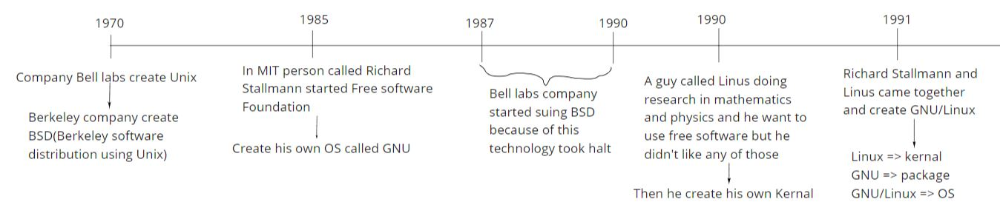
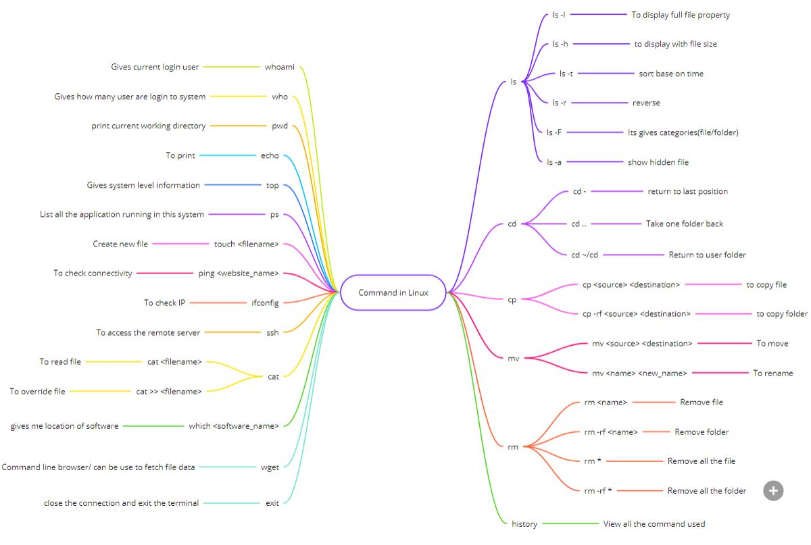

# **Linux**

## **History**

 

## **Distributor**

### **Popular**
* GNU/Linux
* Debian
    * Ubuntu
* Redhat
    * Fedora
    * CentOS
    * Mint

### **Other distributor**
* DOS/Windows
* Unix
* Apple/Unix
* HP/Unix
* FreeBSD
* NetBSD
* OpenBSD

 

## **Commands in Linux**

 

## **File System**

| Path  | Description                                                   |
|-------|---------------------------------------------------------------|
| /     | Root file system use to store other file system partition     |
| /boot | System kernel is stored                                       |
| /bin  | Binary file are stored(all the command are store)             |
| /sbin | System binary file are stored                                 |
| /home | Path where user home directory is created(for normal user)($) |
| /var  | System variable file stored                                   |
| /usr  | User system resource                                          |
| /root | Directory for admin user(#)                                   |
| /tmp  | Temporary storage                                             |
| /etc  | System configuration are stored                               |
| /lib  | System libraries are stored                                   |
| /mnt  | Use to mount external hard drive/USB                          |
| /dev  | External hardware interface                                   |
| /opt  | User software are stored                                      |
| /proc | System level configuration stored                             |

**[Mindmap of linux](../mindmap/linux.jpg)**

